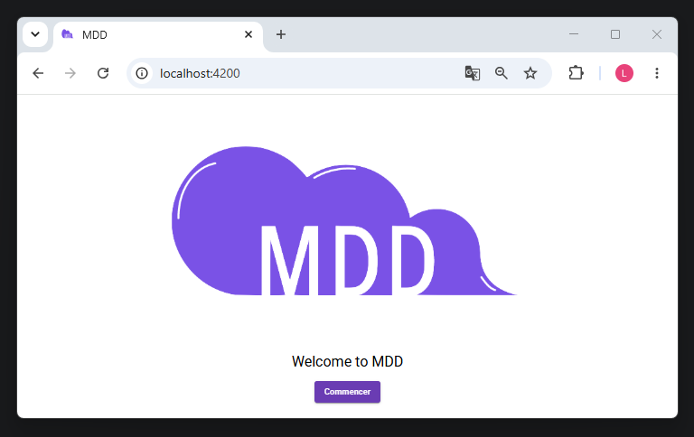
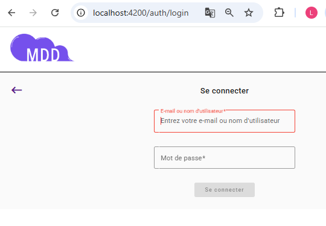
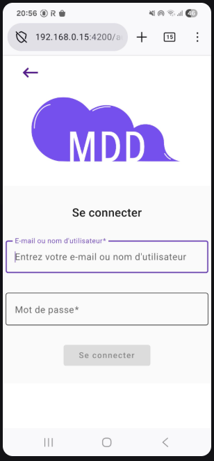
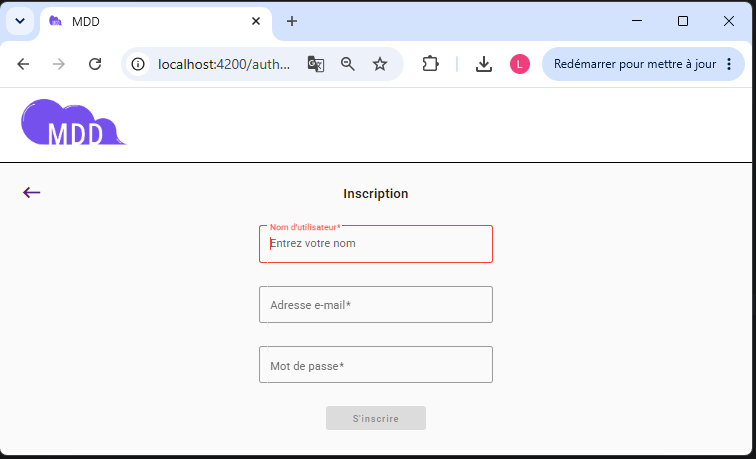
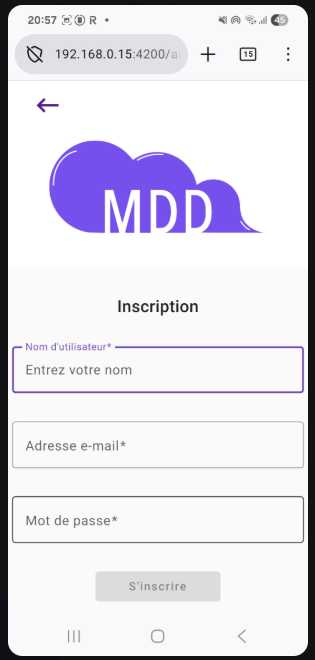
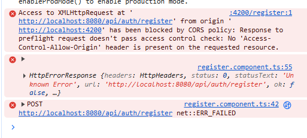
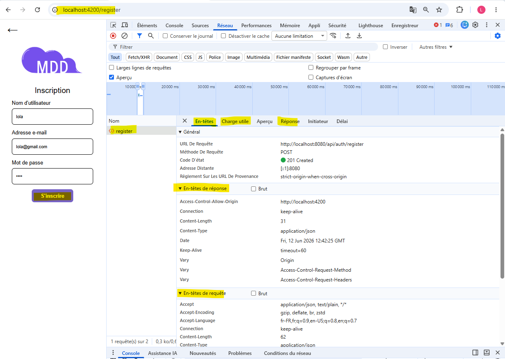
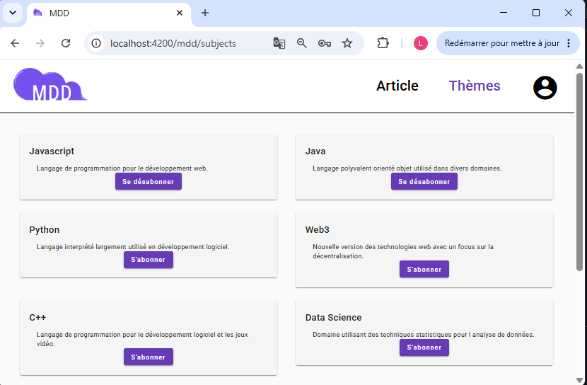
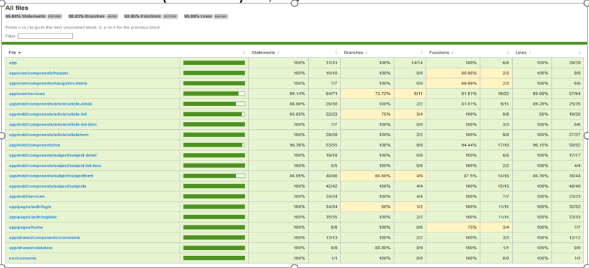
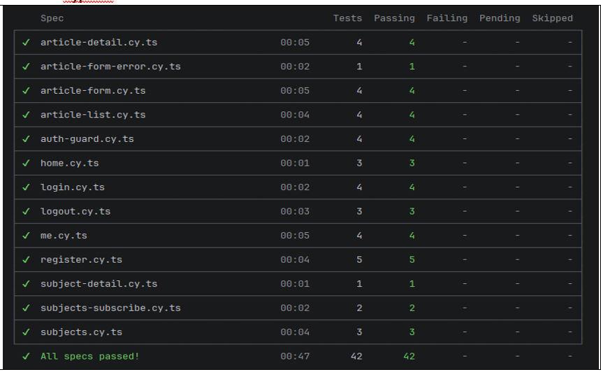

# P6-Full-Stack-reseau-dev

## Front

### clone 
https://github.com/OpenClassrooms-Student-Center/Developpez-une-application-full-stack-complete

### Installation package Angular
>$ npm install

### Démarrage de l'application
> ng serve --host 0.0.0.0

### Lancer les tests Jest Coverage
> $ npx jest --coverage

### Lancer les tests Cypress
> npx cypress run

########################################################################################################

### dev1
1. Application de "README.md" du clone:

- cd front ( il a besoin du fichier package.json )

- npm install
  >$ npm install  
  added 926 packages, and audited 927 packages in 40s

- Démarrage de l'application
  > $ ng serve  
  ** Angular Live Development Server is listening on http://localhost:4200/ **

  Page d'acueil :
  

- Build :
  >$ npx http-server dist/front  
  Starting up http-server, serving dist/front  
  http-server version: 14.1.1  
  Available on:  
  http://169.254.123.141:8080  
  http://192.168.56.1:8080  
  http://192.168.0.16:8080  
  http://127.0.0.1:8080  
  http://172.22.192.1:8080  
  Hit CTRL-C to stop the server

  Page d'acceuil :  
    

### dev2
Remplacer par la vraie page d'Accueil.  
Refactor : home.component.html, home.component.scss  
Page d'accueil desktop :    
  
Page d'acceuil Mobile :   
  

### dev2_MaterialAngular
- Page d'Accueil Figma avec Material Angular  
- Implémentation bouton "mat-stroked-button"  
- Bouton rectangle arrondi : surcharge "mat-stroked-button" avec la classe "btn-rounded"  

Page d'accueil desktop avec Material Angular bouton  btn-rounded :  
  

Page d'accueil mobile avec Material Angular bouton  btn-rounded :  
  

### dev3
Implémenter la page de connexion  
    

### dev4
Implémentation de la page d'inscription  
  

### dev5
- brancher la page d'enregistrement à un Api /api/auth/register
- $ ng generate service services/auth    
        
  => installation sur Spring Boot : CorsConfig.java

-    

..............

### SolutionF
Refactorisations et Implémentations complets des codes : 
- Inscription
- Connexion
- Modifier le profile
- logout
- Connexion
- Abonnement à un thèmes
- fil d'actualité
- ajoute un article
- ajout une commentaire à un article

Page des thèmes de MDD :  

Pour le reste des images voir "Documentation et rapport du projet MDD" pour les screenshots dans l'annexe A.

...........

### SolutionFTest
Tests :  
- Jest coverage  

  Rapport : front/coverage/lcov-report/index.html  
  

- Tests Cypress  

  Rapport de test Cypress  
  

..............

# main
- Merge  

