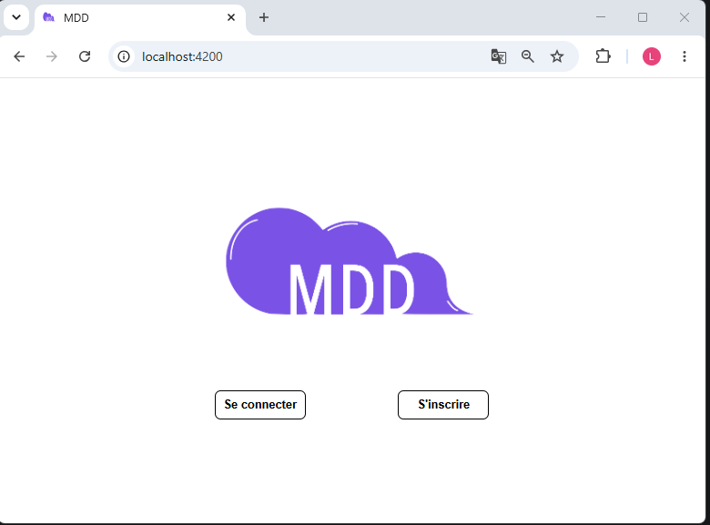
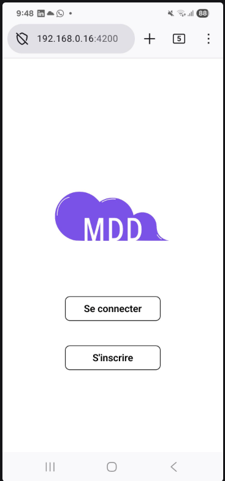
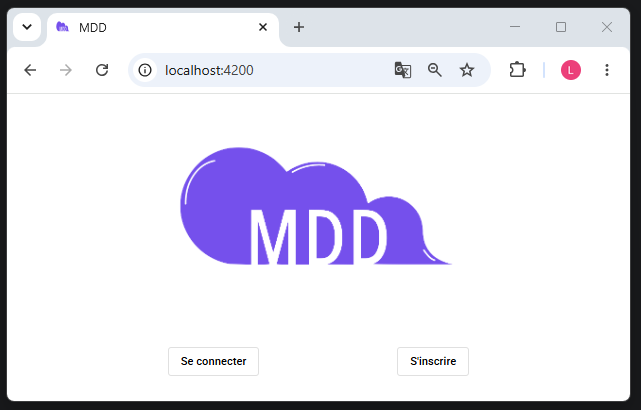
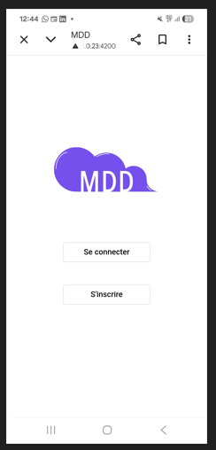

# P6-Full-Stack-reseau-dev

## Front

This project was generated with [Angular CLI](https://github.com/angular/angular-cli) version 14.1.3.

Don't forget to install your node_modules before starting (`npm install`).

### Development server

Run `ng serve` for a dev server. Navigate to `http://localhost:4200/`. The application will automatically reload if you change any of the source files.

### Build

Run `ng build` to build the project. The build artifacts will be stored in the `dist/` directory.

### Where to start

As you may have seen if you already started the app, a simple home page containing a logo, a title and a button is available. If you take a look at its code (in the `home.component.html`) you will see that an external UI library is already configured in the project.

This library is `@angular/material`, it's one of the most famous in the angular ecosystem. As you can see on their docs (https://material.angular.io/), it contains a lot of highly customizable components that will help you design your interfaces quickly.

Note: I recommend to use material however it's not mandatory, if you prefer you can get rid of it.

Good luck!

### dev1
1. Application de "README.md" ci-dessus:

- cd front ( il a besoin du fichier package.json )

- npm install
  >$ npm install  
  added 926 packages, and audited 927 packages in 40s

- Démarrage de l'application
  > $ ng serve  
  ** Angular Live Development Server is listening on http://localhost:4200/ **

  Page d'acueil :
  

- Build :
  >$ npx http-server dist/front  
  Starting up http-server, serving dist/front  
  http-server version: 14.1.1  
  Available on:  
  http://169.254.123.141:8080  
  http://192.168.56.1:8080  
  http://192.168.0.16:8080  
  http://127.0.0.1:8080  
  http://172.22.192.1:8080  
  Hit CTRL-C to stop the server

  Page d'acceuil :  
    

### dev2
Remplacer par la vraie page d'Accueil.  
Refactor : home.component.html, home.component.scss  
Page d'accueil desktop :    
  
Page d'acceuil Mobile :   
  

### dev2_MaterialAngular
- Page d'Accueil Figma avec Material Angular  
- Implémentation bouton "mat-stroked-button"  
- Bouton rectangle arrondi : surcharge "mat-stroked-button" avec la classe "btn-rounded"  

Page d'accueil desktop avec Material Angular bouton  btn-rounded :  
  

Page d'accueil mobile avec Material Angular bouton  btn-rounded :  
  
